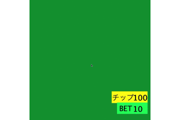

# Trump

## Description
BlackJack  
Hit:Draw a piece of card  
Stand:Not Draw and compete
## Operating
↑↓:Bet change  
←→:Hit，Stand choice  
Z:Decision and forward  

## Demo
<!--  -->

## Run
java -jar Trump.jar

## Requirement
Java8  
IDE:Eclipse  
Library:densan_game_library01_01b  
Download:https://img.atwikiimg.com/www65.atwiki.jp/kindaidensan/attach/20/41/DensanJavaGameLibrary01_01b.zip  
Introduction(Japanese Eclipse):https://www65.atwiki.jp/kindaidensan/pages/14.html  
Introduction(English Eclipse):https://www65.atwiki.jp/kindaidensan/pages/34.html

## License
This software is released under the MIT License, see LICENSE.
